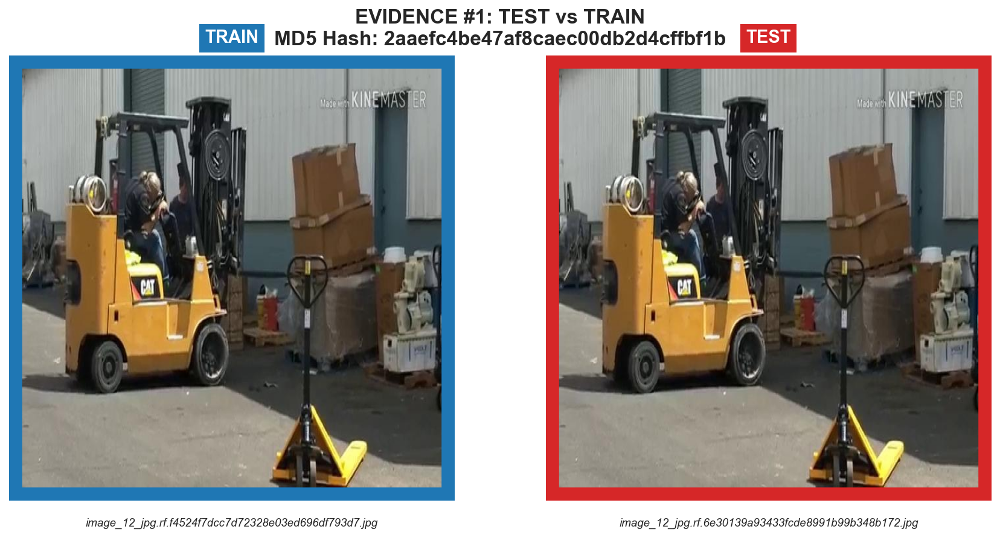
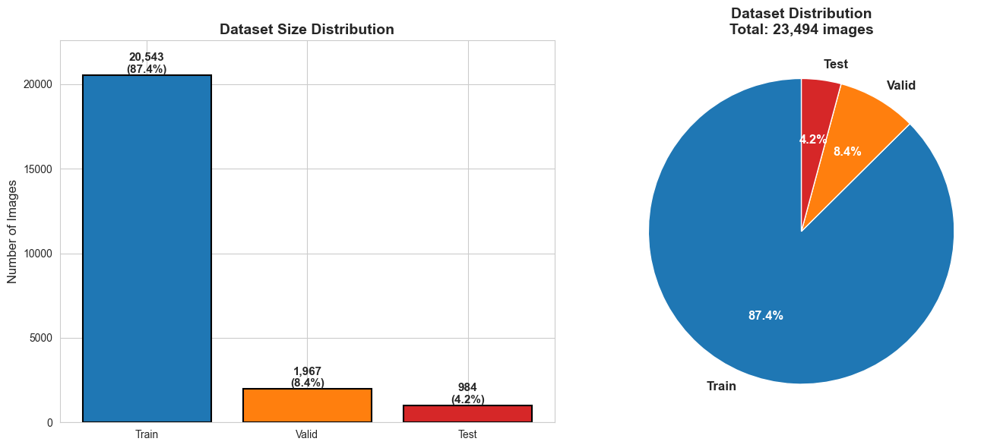
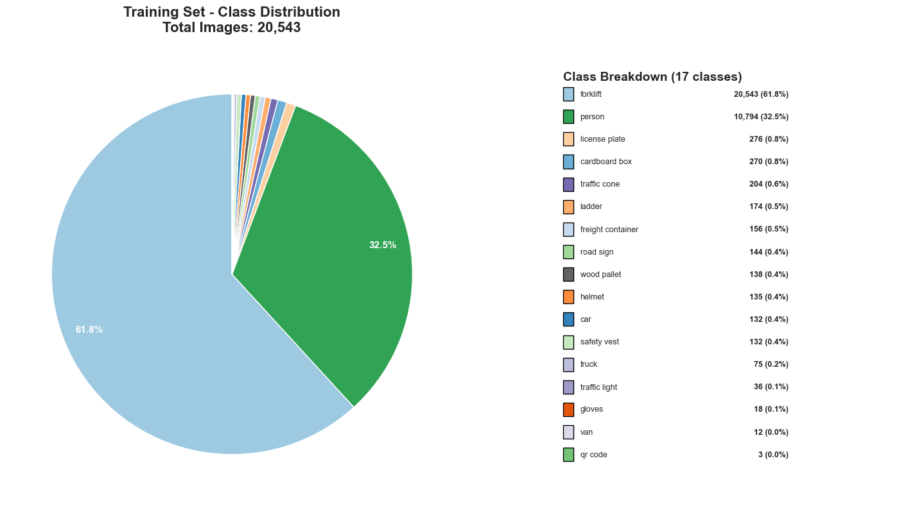
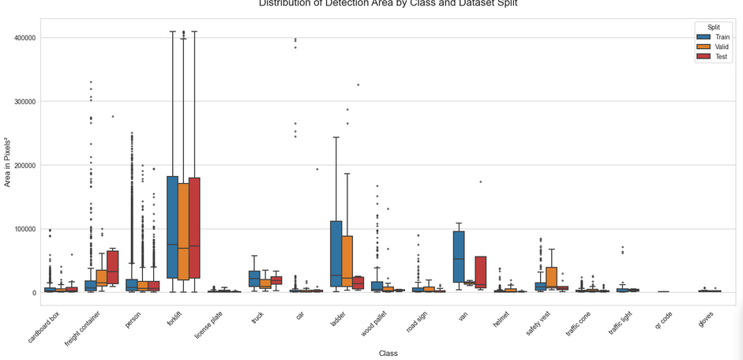
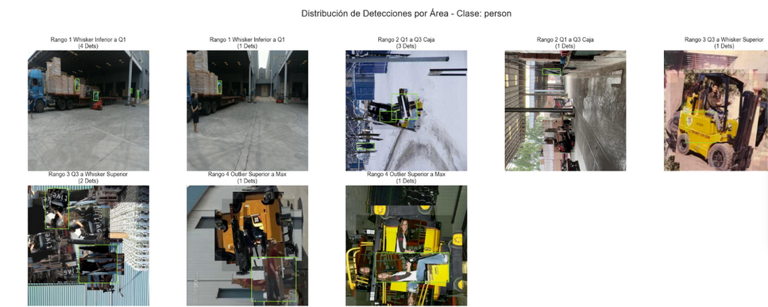
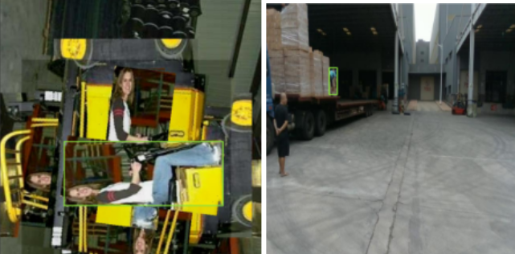
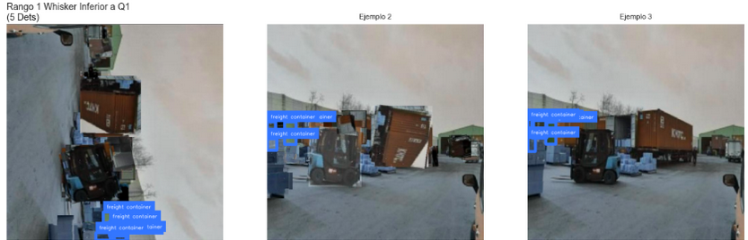
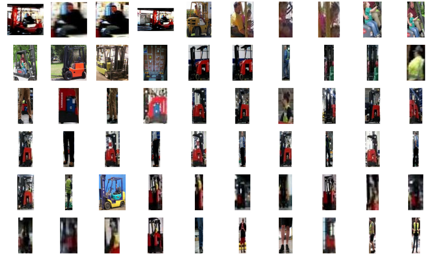
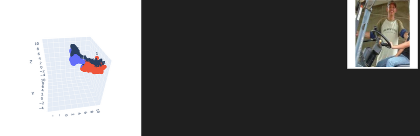

# Desafío: LATAM Data Scientist
**Desarrollador:** Martín Alfonso Campos Donoso
**Fecha:** 01/12/2025

### ✏️ Data Exploration

Explain:
1. Why did you choose these hyperparameters?  
2. How do they affect training time, GPU/CPU usage, and accuracy?  
3. What would you try differently if you had more time or resources?

### ✏️ Metrics Interpretation and Analysis

Provide a short written analysis here:

1. **Quantitative Summary:**
   - What are your `mAP50` and `mAP50-95` values?
   - Which classes achieved the highest and lowest detection performance?

2. **Qualitative Analysis:**
   - Describe common failure cases (e.g., small objects missed, overlapping detections, background confusion).
   - Were there any label quality issues or inconsistencies you observed?

3. **Improvement Proposals:**
   - Suggest at least two improvements (data augmentation, loss tuning, class balancing, etc.).
   - How would you validate whether these changes actually help?


---

## 1. Integridad de los Datos (Data Leakage)

Se ha realizado una validación cruzada entre los conjuntos de datos para asegurar la fiabilidad de las métricas futuras.

* **Hallazgo:** Se detectaron **10 instancias** de fuga de información (imágenes duplicadas o muy similares) entre los sets de entrenamiento y validación/prueba.
* **Acción:** Estas imágenes se han aislado y detallan en `reporte_fugas/resumen_fugas.csv`.
* **Impacto:** Es crítico removerlas para evitar un sobreajuste ficticio en las métricas de evaluación.

<div align="center">
  
  <p><em>Figura 1: Ejemplos de imágenes duplicadas encontradas entre splits.</em></p>
</div>

---

## 2. Análisis de Distribución y Balance de Clases

Se analizó la cardinalidad y distribución de las etiquetas para detectar desbalances que puedan afectar el rendimiento del modelo.

### Distribución por Conjunto de Datos
Se observa una desproporción en el volumen de datos. **Recomendación:** Aumentar el tamaño de los conjuntos de validación y prueba para garantizar significancia estadística.

<div align="center">
  
  <p><em>Figura 2: Distribución de la cantidad de etiquetas (Train/Val/Test).</em></p>
</div>

### Desbalance de Clases
Existe un **desbalance severo**:
* **Clases Dominantes:** `forklift` y `person`.
* **Clases Minoritarias:** Resto de las clases.
* **Tamaño de anotaciones:** Varía significativamente, lo cual es típico en detección de objetos pero requiere atención en los anchors del modelo.

<div align="center">
  
  
  <p><em>Figura 3 y 4: Concentración de clases y distribución de tamaños de bounding boxes.</em></p>
</div>

---

## 3. Calidad del Etiquetado y Aumentación

La inspección cualitativa revela problemas de calidad que introducen ruido en el entrenamiento (Label Noise).

**Problemas detectados:**
1.  **Corrupción por Aumentación:** Algunas transformaciones parecen haber degradado la imagen o las etiquetas.
2.  **Falsos Negativos (Missing Labels):** Objetos presentes (especialmente personas y contenedores) que no fueron etiquetados.

<div align="center">
  
  <p><em>Figura 5: Visualización de ground truth en la clase Personas.</em></p>
</div>

A continuación, se evidencian casos críticos de falta de etiquetado:

<div align="center">
  
  
  <p><em>Figura 6: Ejemplos de objetos no etiquetados (Personas y Freight Containers).</em></p>
</div>

### Visualizacion de las etiquetas de personas y forklift
<div align="center">
  
  <p><em>Figura 7: Muestreo de etiquetas para Forklift y Person.</em></p>
</div>

---

## 4. Consistencia Visual y Espacio Latente

Se realizó una proyección del espacio de características (Feature Space) para validar la separabilidad de las clases.

**Análisis del Video:**
El análisis dinámico muestra que las clases **Forklift** y **Person** poseen características visuales bien definidas, agrupándose correctamente en el espacio latente. Esto sugiere que, a pesar del ruido en las etiquetas, el modelo debería ser capaz de converger en estas clases principales.

<div align="center">
  <video width="80%" controls>
    <source src="videos/clusterizacion.mp4" type="video/mp4">
    Tu navegador no soporta la etiqueta de video.
  </video>
  <p><em>Video 1: Visualización dinámica de la clusterización de etiquetas.</em></p>
</div>

<div align="center">
  
  <p><em>Figura 8: Clusterización estática basada en características visuales.</em></p>
</div>

---

## 5. Conclusiones y Próximos Pasos

### Resumen del Dataset
* ✅ **Integridad:** Todas las etiquetas tienen imágenes asociadas.
* ✅ **Consistencia:** Los 3 conjuntos (Train/Val/Test) comparten el mismo esquema de clases.
* ℹ️ **Background:** No existen imágenes de fondo (sin etiquetas), lo cual puede aumentar los Falsos Positivos en producción.

### Estrategia Sugerida
1.  **Limpieza de Fugas:** Eliminar inmediatamente las 10 imágenes del reporte de fugas.
2.  **Data Curation:** Priorizar una revisión manual o asistida por modelo para corregir los *missing labels*.
3.  **Estrategia de Sampling:** Dado el desbalance, utilizar técnicas de *oversampling* para las clases minoritarias o funciones de pérdida ponderadas (Weighted Loss).

---

## 6. Entrenamiento del Modelo (Part II)

### Configuración del Modelo

Se utilizó **YOLOv8 nano (yolov8n.pt)** como modelo base para el entrenamiento, optimizando el balance entre velocidad de inferencia y precisión.

#### Hiperparámetros de Entrenamiento

```python
EPOCHS = 50
IMGSZ = 640
BATCH = 16
DEVICE = 'cuda' if torch.cuda.is_available() else 'cpu'
```

### Proceso de Entrenamiento

El modelo fue entrenado utilizando el dataset procesado y validado en las secciones anteriores. El entrenamiento se realizó con las siguientes características:

- **Arquitectura:** YOLOv8 Nano
- **Dataset:** Imágenes de 640x640 píxeles
- **Épocas:** 50 iteraciones completas sobre el dataset
- **Batch Size:** 16 imágenes por lote
- **Optimizador:** AdamW (por defecto en YOLO)
- **Data Augmentation:** Augmentaciones nativas de YOLOv8 (mosaic, flip, scale, etc.)

### Resultados del Entrenamiento

El modelo entrenado se guardó en `challenge/artifacts/model/model_best.pt` y está listo para ser utilizado en inferencia.

#### Métricas de Evaluación

Las métricas de validación incluyen:
- **mAP50:** Precisión promedio con IoU threshold de 0.5
- **mAP50-95:** Precisión promedio con IoU thresholds de 0.5 a 0.95
- **Precisión y Recall** por clase

Los resultados detallados del entrenamiento se encuentran en el notebook `challenge/02_model_training.ipynb`.


